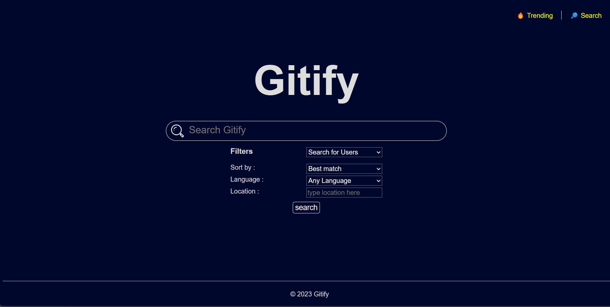

# Gitify 

Gitify is a GitHub Stats API that allows users to retrieve comprehensive information about users and repositories by searching the using github search api. This API provides a user-friendly interface to access a wide range of data related to GitHub users, repositories etc. It also allows users to sort the search by number of stars, most forks, relevance etc.

## Table of Contents

- [Project Overview](#Project-Overview)
- [key Functionality](#Key-Functionality)
- [Environment](#environment)
- [Usage](#usage)
- [Examples of Use](#examples-of-use)
- [Issues](#issues)
- [Athors](#Authors)
- [Deployment](Deployment)

## Project Overview

The objective of this project is to create a user-friendly API that simplifies the process of retrieving and presenting GitHub user statistics. It retrieves information such as  followers and following counts, trending repositories, stars . Whether you're a developer assessing your GitHub activity or an organization looking to analyzing contribution of your employees,looking to hire new developer in the companies. Gitify allows you to easily access their stats by just searching their name. Users can search for trending repositories, Gitify offers these features and more.

## Key Functionalities

- **User Search:** Search for GitHub users based on various criterias, such as programming language expertise or location of the user, and can be sorted by number of stars, forks, and recently updated.

- **Repository Search:** Search for GitHub repositories based on various critreias, such as programming language and can be sorted by number of stars, forks, and recently updated.

- **Trending repositories** displays trending repositories in the current month

- **Pangination of results** displays results in different pages instead of displaying all results in one page.

- **Filtering results** when searching for repositories or users, Gitify has features for filtering results based on the location of the user and the programming language usage of the user and repositories.

## Environment

The Gitify is developed using python and flask for the backend and HTML and CSS for the frontend. It interacts with the GitHub search API and requires the use of OAuth tokens for authentication.
python packages dependencies - flask, requests.

## Usage

clone the repo.
add github access token as environment variable (ACCESS_TOKEN). for ubuntu `export ACCESS_TOKEN="place_your_token_here"`, or `set ACCESS_TOKEN="place_your_token_here"` for windows command line.
run `python app.py`
navigate to home page in http://127.0.0.1:5000

## Examples of Use
to look for trending repositories - `http://127.0.0.1:5000/trending`
to search for users by user name - `http://127.0.0.1:5000/users`- type key words in the search bar to get results
to search for repositories - `http://127.0.0.1:5000/repos`type key words in the search bar to get results

## Issues

If you encounter any issues or bugs while using the GitHub Stats API, please report them in the [Issues](#issues) section. We appreciate your feedback and will work to resolve any problems promptly.

## Link to the site

Gitify - [Gitify](http://web-02.shakir.tech/gitify)

## Authors

Tebogo Legoabe - [Github](https://github.com/TebogoLegoabe) / [LinkedIn](https://www.linkedin.com/in/tebogo-legoabe)
Shakir Muhammedsaid - [Github](https://github.com/Shakir-ahmed1) / [LinkedIn](https://www.linkedin.com/in/shakir-ahmedsalih10)

